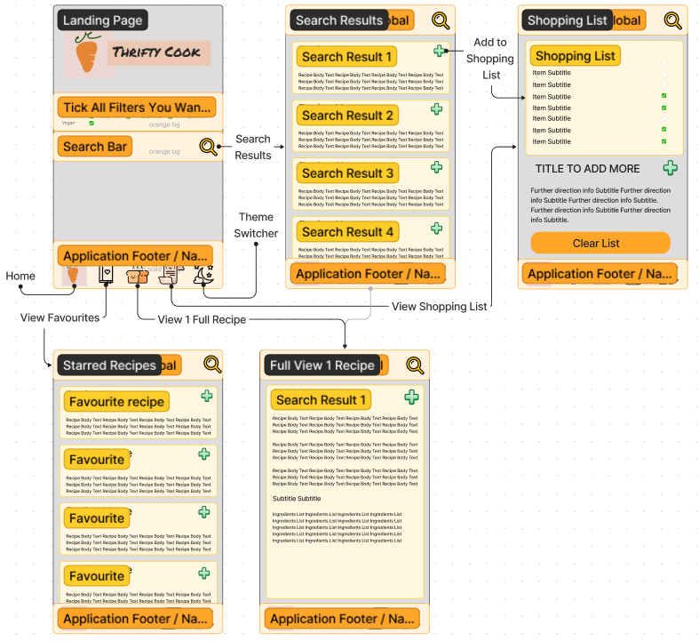
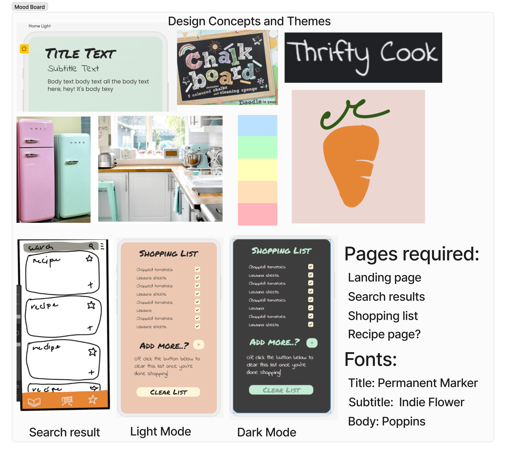
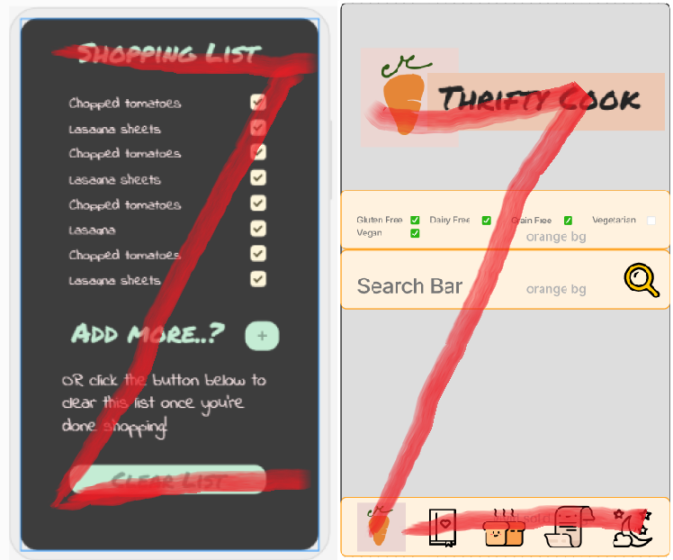
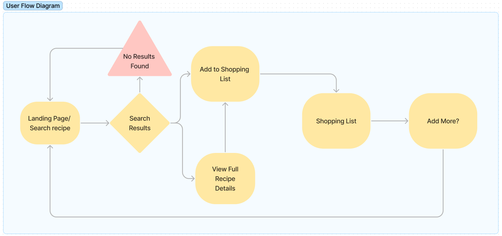
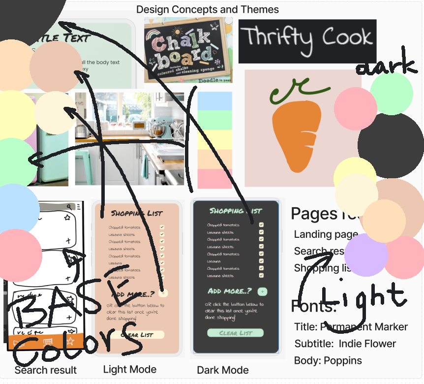

# Code First Girls Mobile Development +masters Course Final Project Documentation

# Thrifty Cook

### Developed by:
- [Joanna Bek](https://github.com/asikowe)
- [Anna Lewandowska](https://github.com/anna-lewandowska)
- [Rebecca Jewers](https://github.com/FuckinGandalfMan)
- [Susanna Parolo](https://github.com/susannaparolo)

-----------------------------------------------------------------------

## INTRODUCTION

### Aim & objective of our project: 

### What are we building? What are the key features of our application?

We'v'e built a grocery list generator. Our application enables the user to browse 5,000+ recipes via the [Spoonacular API](https://spoonacular.com/food-api), view them, add them to user’s own favourites list and/or to generate the grocery shopping list for the recipe or recipes selected by the user. 

Thanks to the level of detail provided by the API we were able to calculate exactly how much of each item is needed for each recipe selected, generating a precise grocery list (e.g we will add tomatoes needed to make a tomato soup and a tomato pasta, updating the grocery list as you go).

### Why are we building this in particular? What’s our vision & goal?

We wanted to create an application to facilitate the process of the weekly meal prep. With this application the user can focus on recipe selection as the grocery shopping list will be auto generated, they don’t need to write anything down manually and remember to take the notebook or piece of paper where they jotted it down with them when going shopping. We imagine this should save up some time and relieve some stress of the users of our application.

---------------------------------------------------------------------

## SPECIFICATIONS AND DESIGN 

This application wass designed for personal use, under the assumption that just like a mobile phone is used by 1 person, this application will also be used by 1 and the same person, owner of the phone - therefore we chose not to implement the multiple user functionality with registration, user verification, multiple accounts & logging in.

### Core architecture & features:

- Search bar to search through the recipes
- Recipes returned by search presented on cards in a scrolling view
- Full view of a selected recipe on a separate screen
- Shopping cart icon adding selected recipe’s ingredients to the shopping list
- Star icon adding selected recipe to the favourites list
- Favourite recipes list page (screen)
- Shopping list page (screen)
- Navigation bar with iconed tabs to navigate between the pages (screens)
- Chalkboard inspired application look / style complete with a hand drawn icon

### Possible future development ideas:

- Light & Dark Themes with an easy to use switch
- Imperial & Metric unit measure switch
- Same ingredient quantities sum up (not to have the same ingredient listed twice on the grocery list)
- Clickable filters enabling the user to filter & limit the search results by their preferences such as food allergies, dietary requirements
- Allow multiple user usage (multiple lists or multiple users)

### Application's Wireframe:

### Design & Color Code Moodboard:

We decided that since the application is created mostly with UK users in mind, we will go with a design idea that seemed most appealing to UK users - a dark anthracite chalkboard with powdery pastel colour accents with possible reference to pantone kitchen and iconic SMEG appliance design. We opted for this design as it evokes the "Chalkboard shopping/to-do list in the kitchen" theme, which is likely to be recognisable to many users. We also wanted to include the cute carrot drawn by Susanna which we all really liked:

### Design Heuristics:           
            
*Mapping and Recognition:*
                
To improve the mapping and recognition of our app we opted for a Z-Pattern layout, with a navigation bar at the bottom of the screen and the searchbar or App name easy to find at the top.  
We also made sure to use familiar icons where possible, such as a "plus" icon to ass items to the basket, and a "star" for adding to favourites. These icons will be easily recognised by most users, allowing them to understand the navigation and functions available to them on each page.

            
                 
*Consistency:*           

In order to keep the consistency of the app we made sure to use the same design for buttons and icons on each page, to place the search bar and navigation bar in the same place and order n each page, to use different fonts for title, subtitle and body texts, and to ensure consistency of when and how each was used.           
Another decision we made for consistency was to have the modules showing recipe titles and details be exactly the same on both the search results page and the Favourites page where users may view saved recipes.           
Throughout the project the team kept a high level of communication and joint decision making over design and layout decisions, ensuring that the work we produced was consistant throughout the entire app.            
           
*Minimalism:*       
        
We have tried to keep the app as minimalist as possible, only including simple directional statements or words where needed, and showing only a small preview of each recipe on the results and favourites page to avoid overwhelming users with too much information. This was also important in allowing key information to stand out and to be in keeping with our minimalist Chalkboard theme, which meant we did not want to have too many colours or elements cluttering the page.         
             
*Flexibility & Freedom:*           
                
In order to improve flexibility and freedom of the app we made sure to include the navbar on each page so users could move between screens quickly, we also allowed flexibility in that you can open and view a recipe in detail without automatically adding it's ingredients to your shopping list. This allows for people to use the app just as a tool to look up recipes, even when they don't want to build a shopping list.     
Additionally we have an "Add more" button on the shopping list page so users can input additional items or recipes by tapping, and they can also clear an existing shopping list or tick off items the already have.               
When no results are found or a user changes their mind and wishes to search for a new recipe, the search bar is easily available at the top of the screen on the results page. Users may also add items into their favourites or shopping list without being automatically redirected, making the app easier and quicker to use for those who are building up a large shopping list of recipe collection.
Our User Flow diagram shows our intended user flow experience, as well as how users whose search returns no results can easily search again.      
         
    

*Help, Error Handling and Prevention:*                

As shown above in our User Flow, when a user's search returns no results they will be shown an error message explaining that no results have been found and prompting them to search again, which they can do using the search bar.           
We also have functions allowing users to tick off items they do not need on their shopping list, to add and remove favourites, and to clear their list altogether if they wish to start again or have made an error.        
Throughout the app we have sought to consistently and clearly signpost the user so they can understand their options and can avoid errors. We have done this as stated above with a combination of recognisable icons, minimalist designs, and written prompts - for example, the annotations used under icons in our navbar or indicating the search bar.         
                   
*Visibility:*       

In order to increase the visibility we have annotated the search bar and navbar, have opted for a high contrast (pastels on black) colour scheme to ensure objects stand out on the page, and have used loading circles to indicate to users when the app is loading in results. This will help avoid confusion about the status of the app, and indicates to users that it is loading results as opposed to having crashed.                            
                        
-----------------------------------------------------------------------

## IMPLEMENTATION AND EXECUTION 

### Development approach and team member roles: 

We started off from deciding what our application should be doing as its chief function, then gave ourselves a couple of days to come up with propositions and moodboard ideas. On our next meeting we have presented our ideas, clarified 1 moodboard from them, drew up the wireframe, listed up key features in Trello and declared who is tentatively interested in doing what. We kept tracking our progress with Slack & Trello holding approximately biweekly meetings on Google Meet to discuss the issues we’ve encountered, review the progress and assign new tasks.

### Tools and libraries used:

We've planned to use React Native with Redux, and we were able to stick with this plan. We needed to use additional libraries for the navigation bar (react-navigation/bottom-tabs), the icons (react-native-ionicons), adding to the shopping & favourites lists (react-native-async-storage/async-storage, redux, redux-persist and redux-thunk) and for the light/dark theme switch (rneui/base, rneui/themed, react-context and react-native-paper).

For the recipes, we decided to use the [Spoonacular API](https://spoonacular.com/food-api) at the beginning of this project.

We've also used Visual Studio Code, Node.js package manager, Expo and Git for version control.

### Design tools used:

Figma for moodboard & design, Photoshop for icons & colour coding our app

Colours used in the process of designing the app are stored in Colors.txt file with description, hex & RBG values - even the colours which are not presently being used are saved there for legacy purposes, also they might be used for developing themes in the future.

### Planning & Project Management tools used:

Jamboard, Trello Board, Slack, Google Meet and Zoom

### Implementation process highlights:

Challenge & Achievement : The star for adding recipes to favourites list fills in when a recipe is added to the favourite recipes list and removes the filling back to outline of a star only when a recipe is not in the favourite recipes list.

Challenge & Achievement : After some trial and not much error it was decided to stick to JS styling for language coherency (a few items such as the bottom tab navigation bar could not be styled in CSS, only in JS, and only in the hardcoded way).

Challenge & Decision to change : Due to lack of success with the Light & Dark switch we’ve removed it from the final submission version of our project. 

---------------------------------------------------------------------------

## TESTING AND EVALUATION

### Functional and user testing:

Search bar was tested via input, navigation was tested by clicking through. Testing for items rendering & positioning was successful.

### System limitations:

This app is designed for 1 user only, for personal use. If multiple users would wish to use it on the same phone, they will need to share the shopping and favourites lists for now.

---------------------------------------------------------------------------

## CONCLUSION

We are glad to be able to deliver the project which has properly working key features and looks nice on the eyes, reflecting the original design ideas and moodboard we had in mind. 
